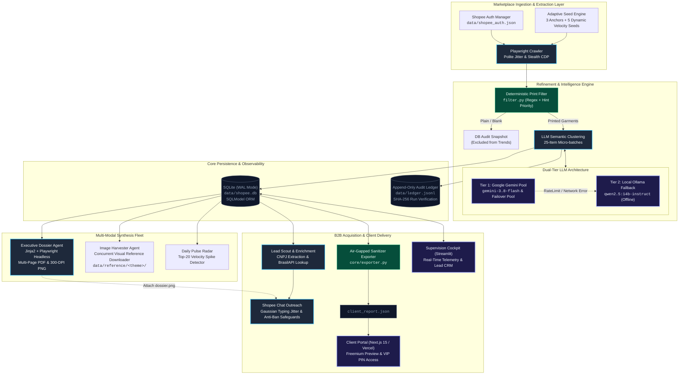

<div align="center">

# ⚡ TrendScout (TrendScout BR)
### Autonomous E-Commerce Trend Intelligence & B2B Growth Pipeline

[](https://www.python.org/)
[](https://nextjs.org/)
[](https://playwright.dev/)
[](https://ai.google.dev/)
[](https://sqlmodel.tiangolo.com/)
[](https://docs.pytest.org/)
[](LICENSE)

*An end-to-end multi-agent ecosystem engineered to track real-time sales velocity, filter commodity noise, semantically cluster apparel print themes via LLMs, synthesize C-level intelligence dossiers, and automate B2B merchant acquisition across the Brazilian e-commerce market.*

---

</div>

## 📑 Table of Contents
- [Executive Overview](#-executive-overview)
- [System Architecture](#-system-architecture)
- [The Agent Fleet Matrix](#-the-agent-fleet-matrix)
- [Core Engineering Patterns & Innovations](#-core-engineering-patterns--innovations)
  - [1. Adaptive Seed Discovery](#1-adaptive-seed-discovery)
  - [2. Deterministic Print Filtering](#2-deterministic-print-filtering)
  - [3. Dual-Tier Resilient LLM Engine](#3-dual-tier-resilient-llm-engine)
  - [4. Air-Gapped Data Sanitization](#4-air-gapped-data-sanitization)
  - [5. Anti-Detection & Humanized Browser Outreach](#5-anti-detection--humanized-browser-outreach)
- [Repository Layout](#-repository-layout)
- [CLI Reference](#-cli-reference)
- [Getting Started](#-getting-started)
  - [Prerequisites](#prerequisites)
  - [Installation & Environment Setup](#installation--environment-setup)
  - [One-Time Authentication](#one-time-authentication)
- [Supervision & Client Portals](#-supervision--client-portals)
- [Verification & Testing](#-verification--testing)

---

## 🔭 Executive Overview

In fast-fashion and e-commerce marketplace economics (specifically Shopee Brazil), commodity apparel items (plain, blank, basic t-shirts) experience extreme price compression and single-digit margins. Conversely, **graphic printed apparel** (*camisetas estampadas*) commands **40% to 70% gross margins**, driven by micro-cultural waves (streetwear, anime, gym culture, typography, retro aesthetics).

**TrendScout** is a fully automated market intelligence and merchant acquisition infrastructure that:
1. **Audits Marketplace Velocity**: Scrapes and tracks high-velocity listings, isolating genuine consumer demand from ad-boosted noise.
2. **Eliminates Blank Noise**: Executes deterministic pattern filtration to discard plain/dry-fit basics before running expensive analytical models.
3. **Semantically Clusters Cultural Themes**: Leverages dual-tier LLMs (cloud Google Gemini pool with local Ollama Qwen2.5-14B fallback) to cluster Portuguese product titles into actionable commercial themes.
4. **Synthesizes Production Briefings**: Renders high-resolution executive dossiers (multi-page PDF and 300-DPI PNGs) with price dispersion bands, breakout prints, and manufacturing directives.
5. **Drives B2B Merchant Acquisition**: Discovers merchant stores, enriches Brazilian corporate tax registrations (CNPJ) via BrasilAPI, and conducts humanized Shopee Chat B2B outreach with personalized dossier attachments.
6. **Powers an Air-Gapped Subscriber Portal**: Deploys a client-facing Next.js 15 dashboard air-gapped from internal databases for paying subscribers.

---

## 🏛 System Architecture



---

## 🤖 The Agent Fleet Matrix

The platform functions as a coordinated squad of specialized autonomous agents:

| Agent | Module Path | Execution Trigger | Core Inputs | Primary Outputs | Key Technical Heuristic |
|---|---|---|---|---|---|
| **Trend Scout** | `agents.trend_scout.agent` | Weekly (Mon 09:00) | Search keywords, Session cookies | Normalized Theme Clusters, Price Distributions | Adaptive seed generation blending historical velocity with baseline anchors. |
| **Print Filter** | `agents.trend_scout.filter` | Ingestion Pipeline | Raw product titles | Boolean print classification | Deterministic hint-priority regex; print markers strictly override plain indicators. |
| **Image Harvester**| `agents.image_harvester.agent`| Post-Scrape Workflow| Product image URLs, Theme categories | `data/reference/<theme>/*.webp` | Concurrent download pooling with aspect-ratio validation for print design briefs. |
| **Daily Pulse** | `agents.pulse.agent` | Daily (08:30) | Top 20 best-sellers | Velocity diffs, Spike alerts | Real-time delta comparison against previous day snapshots to catch viral surges early. |
| **Executive Dossier**| `agents.dossier.agent` | Weekly Post-Analysis | Clustered themes, Sales metrics | Multi-page PDF & 300-DPI PNG | Headless Playwright browser rendering from Jinja2 templates for print-ready briefings. |
| **Lead Scout** | `agents.lead_scout.agent` | On-Demand / Scheduled | Shopee store profiles | `StoreLead` records, Enriched corporate data | Regex CNPJ extraction with real-time BrasilAPI fallback and Instagram handle parsing. |
| **Outreach Bot** | `agents.outreach.shopee_chat`| Scheduled Campaign | Qualified `StoreLead`, `dossier.png` | Automated Chat deliveries, CRM status | Human-mimicking Gaussian typing jitter, randomized cooldown delays (90–180s). |
| **Supervision Cockpit**| `dashboard.app` | Persistent Operator UI| SQLite DB, JSONL Ledger | Streamlit Web Interface | Run-now background triggers, execution logs, ledger verification, and CRM lead board. |
| **Client Portal**| `web/` | Continuous (Vercel) | Air-gapped `client_report.json` | Next.js 15 Web Application | Zero-database public exposure; static JSON ingestion with VIP PIN verification. |

---

## ⚙️ Core Engineering Patterns & Innovations

### 1. Adaptive Seed Discovery
Rather than querying static keywords that go stale as marketplace consumer jargon evolves, TrendScout implements an adaptive seed engine (`agents/trend_scout/adaptive_seeds.py`):
- **Longitudinal Baseline**: 3 permanent anchor seeds (`camiseta estampada`, `camiseta streetwear`, `camiseta oversized estampada`) ensure consistent year-round trendline metrics.
- **Dynamic Exploration**: 5 rotational slots dynamically generated from previous run velocity:
  $$\text{Score}(theme) = \text{Velocity} \times \ln(1 + \text{SalesVolume})$$
- Keywords matching high-acceleration themes are synthesized and injected into the subsequent scrape cycle, uncovering nascent micro-trends automatically.

### 2. Deterministic Print Filtering
Marketplace searches for apparel routinely pull in massive volumes of high-turnover plain blanks (*camisetas básicas lisas*), which distort cluster analysis and compress median price analytics:
- **Hint-Priority Regex**: The filter evaluates both exclusion patterns (`lisa`, `basica`, `sem estampa`, `dry fit lisa`) and affirmative print indicators (`estampada`, `silk`, `sublimada`, `anime`, `oversized street`, `banda`).
- **Precedence Rule**: Print indicators always win. If a listing is titled *"Camiseta Básica Streetwear Estampa Costas"*, it is correctly preserved.
- **Audit Trace**: Excluded plain shirts are persisted to SQLite for pricing baseline audits, but are strictly excluded from trend reports, reference galleries, and executive dossiers.

### 3. Dual-Tier Resilient LLM Engine
Marketplace titles feature erratic grammar, abbreviations, Portuguese colloquialisms, and keyword stuffing. Robust theme clustering requires semantic reasoning:
- **Cloud Burst Tier**: Google Gemini Flash API (`gemini-3.8-flash`, with an automated fallback pool to `gemini-3.7-flash`, `gemini-3.5-flash`, etc.) handles high-throughput clustering with exponential backoff on HTTP 503/429.
- **Micro-Batch Discipline**: Input items are strictly batched in groups of 25 products. This prevents schema drift, token window bloat, and hallucinated JSON keys.
- **Local Fallback Tier**: If external network access is restricted or API limits are exhausted, the pipeline falls back without downtime to local **Ollama** (`qwen2.5:14b-instruct`).

### 4. Air-Gapped Data Sanitization
The public subscriber portal (`web/`) is completely decoupled from the internal SQLite database:
- `core/exporter.py` sanitizes and transforms raw internal product tables and lead pipelines into an air-gapped `client_report.json`.
- Proprietary internal records (exact supplier links, scraper timestamps, error logs, and B2B CRM phone/CNPJ data) are stripped.
- The Next.js application imports static JSON artifacts, enabling deployment to edge CDNs (Vercel) with zero live database attack surface.

### 5. Anti-Detection & Humanized Browser Outreach
Both the scraping agent and the outreach bot operate under strict anti-bot protocols:
- **Persistent Authenticated State**: Browser storage state (cookies, local tokens) is captured via headful login and persisted to `data/shopee_auth.json`.
- **Typing Simulation**: The outreach bot sends keystrokes with randomized delay distributions modeled on human typing speeds (30–85ms per character).
- **Campaign Throttling**: Messages between merchant shops enforce randomized delays ($90 \le \Delta t \le 180$ seconds) with adaptive session rests to stay below marketplace rate limits.

---

## 📂 Repository Layout

```
.
├── __main__.py                      # Unified CLI entrypoint (10 subcommands)
├── pyproject.toml                   # Project metadata, dependencies, ruff & pytest config
├── AGENTS.md                        # Mission parameters, agent rules & runtime constraints
├── README.md                        # Engineering documentation & architecture
│
├── core/                            # Shared ecosystem infrastructure
│   ├── config.py                    # Pydantic Settings (reads .env, resolves absolute paths)
│   ├── db.py                        # SQLModel SQLite database engine (WAL mode)
│   ├── models.py                    # Schema definitions (Product, PriceSnapshot, StoreLead, etc.)
│   ├── ledger.py                    # Append-only structured execution ledger (audit compliance)
│   ├── llm.py                       # Dual-tier LLM engine (Gemini Flash pool + Ollama fallback)
│   ├── exporter.py                  # Air-gapped JSON sanitizer for public web portal
│   └── scheduler.py                 # Blocking in-process scheduler (weekly deep + daily pulse)
│
├── agents/                          # Autonomous multi-agent implementations
│   ├── trend_scout/                 # Deep scrape, print filter, adaptive seeds & clustering
│   ├── pulse/                       # Daily top-20 velocity spike detection radar
│   ├── image_harvester/             # Async reference image downloader (themed directories)
│   ├── dossier/                     # Playwright HTML/CSS to PDF & high-res PNG synthesis
│   ├── lead_scout/                  # Store lead discovery & BrasilAPI CNPJ enrichment
│   └── outreach/                    # Shopee Chat automated B2B outreach with dossier attachment
│
├── dashboard/                       # Streamlit internal operations cockpit
│   ├── app.py                       # Main supervision UI (telemetry, ledger, gallery, run-now)
│   ├── supervision.py               # Background agent process runners & log streams
│   └── pitches.py                   # Dynamic B2B pitch generator & CRM review
│
├── web/                             # Air-gapped subscriber client portal
│   ├── src/app/                     # Next.js 15 App Router (editorial dark/graphite layout)
│   ├── src/components/              # UI components (BreakoutPrints, FabricRadar, NicheExplorer)
│   └── public/data/                 # Sanitized client_report.json target directory
│
├── scripts/                         # Automation & maintenance utilities
│   ├── install_tasks.ps1            # Windows Task Scheduler registration script
│   ├── uninstall_tasks.ps1          # Task Scheduler deregistration script
│   └── migrate_store_lead_themes.py # Historical lead theme backfill utility
│
├── tests/                           # Comprehensive test suite (222 tests)
│   ├── conftest.py                  # Isolated SQLite fixture & mock test environment
│   └── test_*.py                    # Unit and integration tests for every subsystem
│
└── data/                            # Gitignored local runtime storage (preserved via .gitkeep)
    ├── shopee.db                    # Active SQLite database (WAL mode)
    ├── ledger.jsonl                 # Immutable JSONL audit log
    ├── shopee_auth.json             # Playwright browser authentication state
    ├── reference/                   # Harvested high-res reference garment images
    └── reports/                     # Weekly raw analytical reports (MD, JSON, plots)
```

---

## 💻 CLI Reference

The platform is managed via a single CLI entrypoint:

```bash
# General Syntax
python __main__.py <command> [options]
```

### Command Index

| Command | Flags / Options | Description |
|---|---|---|
| `login` | *None* | Opens a headful browser for manual Shopee authentication; saves session to `data/shopee_auth.json`. |
| `run` | `--dry-run`, `--max <N>` | Runs the full Trend Scout pipeline. Skips if run within the last 24 hours. |
| `run-now` | `--dry-run`, `--max <N>` | Forces an immediate Trend Scout scrape and clustering run regardless of last run timestamp. |
| `pulse` | *None* | Runs the daily spike radar: captures top-20 best-sellers and computes velocity surges. |
| `harvest` | `--max <N>` (default: 50) | Concurrently downloads high-resolution reference images into `data/reference/<theme>/`. |
| `dossier` | `--theme <slug>`, `--html-only` | Compiles the executive intelligence briefing into a multi-page PDF and 300-DPI PNG. |
| `leads` | `--max <N>`, `--no-enrich` | Extracts merchant store leads and enriches corporate entity data via BrasilAPI. |
| `outreach-chat` | `--limit <N>`, `--dry-run`, `--lead-id <ID>`, `--headless`, `--delay-min <S>`, `--delay-max <S>` | Dispatches automated B2B messages with attached `dossier.png` via Shopee Web Chat. |
| `export-web` | `--report-dir <path>` | Sanitizes internal reports and exports `client_report.json` to the Next.js web portal. |
| `dashboard` | *None* | Launches the Streamlit operator supervision dashboard and CRM hub. |
| `schedule` | *None* | Starts the blocking background scheduler (weekly deep scrape + daily pulse). |

---

## 🚀 Getting Started

### Prerequisites
- **Python 3.11+**
- **Node.js 20+** & **npm** (for the client portal)
- **Google Chrome** installed (used by Playwright for session authentication)
- **Ollama** (optional, for offline LLM fallback): `ollama pull qwen2.5:14b-instruct`

### Installation & Environment Setup

1. **Clone the repository**:
   ```bash
   git clone git@github.com:owmyr/ShopeeStore.git
   cd ShopeeStore
   ```

2. **Configure Python Virtual Environment**:
   ```bash
   python -m venv .venv
   source .venv/bin/activate  # On Windows: .\.venv\Scripts\Activate.ps1
   pip install -e ".[dev]"
   playwright install chromium
   ```

3. **Configure Environment Variables**:
   ```bash
   cp .env.example .env
   ```
   Edit `.env` to configure your settings:
   ```ini
   # LLM Provider Configuration
   LLM_PROVIDER=gemini
   GEMINI_API_KEY=your_gemini_api_key_here
   LLM_MODEL=qwen2.5:14b-instruct
   LLM_HOST=http://localhost:11434

   # Scraper Parameters
   SCRAPE_MAX_PRODUCTS=640
   SCRAPE_MAX_PER_KEYWORD=80
   SCRAPE_KEYWORD="camiseta estampada"

   # Brand Identity & Outreach
   SENDER_NAME="Trend Scout BR"
   SENDER_EMAIL=contato.trendscout@gmail.com
   PORTAL_URL=https://trendscout-shopee.vercel.app
   ```

### One-Time Authentication
Anonymous marketplace scraping is blocked by login walls. Execute the one-time authentication command:
```bash
python __main__.py login
```
A browser window opens. Log in with your Shopee credentials (email/password). Upon successful detection, the session cookies and storage state are saved to `data/shopee_auth.json`.

---

## 🖥 Supervision & Client Portals

### 1. Supervision Operator Dashboard (Streamlit)
Launch the operator cockpit:
```bash
python __main__.py dashboard
```
Accessible at `http://localhost:8501`. Features include:
- **Agent Ledger Audit**: Historical run durations, exit codes, and output hashes.
- **Interactive Cluster Explorer**: Real-time sales volume by theme, price band distribution, and keyword coverage.
- **Reference Image Gallery**: Visual inspection of top-selling garments by category.
- **One-Click Execution**: Force run Trend Scout, Image Harvester, or Daily Pulse directly from the browser.
- **Lead CRM**: Real-time status of discovered merchants, CNPJ verification status, and outreach interaction logs.

### 2. Client Subscriber Portal (Next.js 15)
Navigate to the web portal directory:
```bash
cd web
npm install
npm run dev
```
Accessible at `http://localhost:3000`. Features include:
- **Graphite Editorial Design**: High-contrast, typography-driven presentation optimized for apparel manufacturers.
- **Air-Gapped Telemetry**: Reads strictly from `public/data/client_report.json`.
- **Freemium & VIP Gate**: Unlocks detailed manufacturing directives and breakout print cards via VIP PIN authentication.

---

## 🧪 Verification & Testing

The repository maintains strict test discipline with **222 automated tests** across all subsystems:

```bash
# Execute linting and formatting checks
ruff check .

# Execute full pytest suite with isolated in-memory/temp database fixtures
pytest
```

---

<div align="center">
  <sub>Built for precision e-commerce intelligence & high-margin manufacturing operations.</sub>
</div>
